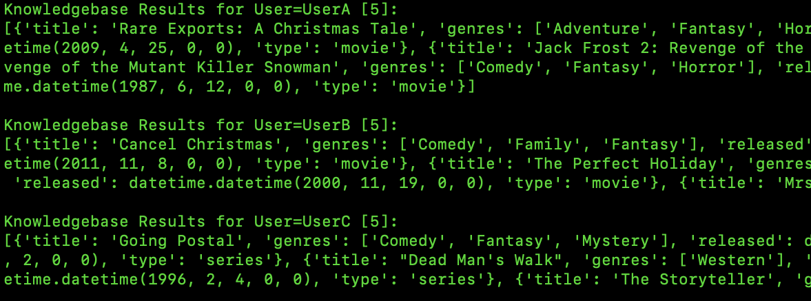

# local-atlas-RAG



This README guides you through setting up a local Retrieval-Augmented Generation (RAG) environment with MongoDB Atlas and sample datasets.

### Prerequisites

* **MongoDB Tools:**
  * **mongosh:** The official MongoDB shell for interacting with MongoDB databases.
  * **mongorestore:** A tool for restoring data from a dump file to a MongoDB database.
* **Docker:** Installed on your system ([https://www.docker.com/products/docker-desktop/](https://www.docker.com/products/docker-desktop/))
* **wget or curl:** Installed on your system (package managers usually handle this)
* https://www.mongodb.com/docs/atlas/cli/current/atlas-cli-deploy-local/  (this is a great resource also)


### Setting Up a Local Atlas Environment

1. **Pull the Docker Image:**

   * **Latest Version:**
     ```bash
     docker pull mongodb/mongodb-atlas-local
     ```

2. **Run the Database:**

   ```bash
   docker run -p 27017:27017 mongodb/mongodb-atlas-local
   ```
   This command runs the Docker image, exposing port 27017 on your machine for connecting to the database.

### Using Sample Datasets with MongoDB

This section demonstrates downloading and exploring a sample dataset for MongoDB on your local system.

#### Downloading the Dataset

There's a complete sample dataset available for MongoDB. Download it using either `wget` or `curl`:

* **Using wget:**

```bash
wget https://atlas-education.s3.amazonaws.com/sampledata.archive
```

* **Using curl:**

```bash
curl https://atlas-education.s3.amazonaws.com/sampledata.archive -o sampledata.archive
```

**Note:**

* Ensure you have `wget` or `curl` installed.
* The downloaded file will be named `sampledata.archive`.

#### Restoring the Dataset

Before restoring, ensure you have a local `mongod` instance running (either existing or newly started). This instance will host the dataset.

**To restore the dataset:**

```bash
mongorestore --archive=sampledata.archive
```

This command uses the `mongorestore` tool to unpack the downloaded archive (`sampledata.archive`) and populate your local `mongod` instance with the sample data.

### Creating an Atlas Vector Search Index with mongosh

**Steps:**

1. **Connect to Local Atlas Cluster:**

   Use `mongosh` to connect to the database:

   ```bash
   mongosh "mongodb://localhost/?directConnection=true"
   ```

2. **Switch to the Database:**

   Select the database containing the collection you want to index:

   ```javascript
   use sample_mflix
   ```

3. **Create the Index:**

   ```javascript
   db.embedded_movies.createSearchIndex(
       "vector_index",
       "vectorSearch", // index type
       {
           fields: [
               {
                   "type": "vector",
                   "numDimensions": 1536,
                   "path": "plot_embedding",
                   "similarity": "cosine"
               },
               {"type":"filter","path":"genres"},
               {"type":"filter","path":"type"}
           ]
       }
   );
   ```

4. **Check the Index Status:**

   ```javascript
   db.embedded_movies.getSearchIndexes()
   ```

5. **Wait for Status 'READY'**:

   A successful response will look similar to this:

   ```json
   [
       {
           "id": "...",
           "name": "vector_index",
           "type": "vectorSearch",
           "status": "READY",
           "queryable": true,
           "latestVersion": 0,
           "latestDefinition": {
               "fields": [
                   {
                       "type": "vector",
                       "numDimensions": 1536,
                       "path": "plot_embedding",
                       "similarity": "cosine"
                   }
               ]
           }
       }
   ]
   ```


## Sample code for RAG using Access Control List and Filters
```python
import pymongo
from openai import AzureOpenAI

MONGODB_URI = "mongodb://localhost/?directConnection=true"
client = pymongo.MongoClient(MONGODB_URI)
db = client["sample_mflix"]
collection = db["embedded_movies"]

AZURE_OPENAI_ENDPOINT = ""
AZURE_OPENAI_API_KEY = "" 
deployment_name = "text-embedding-ada-002"  # The name of your model deployment
az_client = AzureOpenAI(azure_endpoint=AZURE_OPENAI_ENDPOINT,api_version="2023-07-01-preview",api_key=AZURE_OPENAI_API_KEY)

#the $vectorSearch filter option matches only BSON boolean, string, and numeric values 
# so you must index the fields as one of the following Atlas Search field types.
LOCAL_ACL = {
     "UserA":{
          "genres":{"$eq":"Horror"}, # only has access to horror movies
     },
     "UserB":{
          "genres":{"$in":["Romance","Comedy"]}, # only has access to romance movies
     },
     "UserC":{
          "type":{"$ne":"movie"}, # only has access to non-movies
     }
}

def vs_tool(text,user_id):
        #$vectorSearch
        chunk_max_length = 1000
        response = collection.aggregate([
        {
            "$vectorSearch": {
                "index": "vector_index",
                "queryVector": az_client.embeddings.create(model=deployment_name,input=text).data[0].embedding,
                "path": "plot_embedding",
                "filter": LOCAL_ACL[str(user_id)],
                "limit": 5, #Number (of type int only) of documents to return in the results. Value can't exceed the value of numCandidates.
                "numCandidates": 30 #Number of nearest neighbors to use during the search. You can't specify a number less than the number of documents to return (limit).
            }
        },{"$project":{"_id":0, "title":1, "genres":1, "released":1, "type":1}},{"$sort":{"released":-1,"awards.wins":-1}}
       ])
        str_response = []
        for d in response:
            str_response.append({"title":d["title"],"genres":d["genres"],"released":d["released"],"type":d["type"]})
        
        if len(str_response)>0:
            return f"Knowledgebase Results for User={user_id} [{len(str_response)}]:\n{str(str_response)}\n"
        else:
            return "N/A"

       
print(
    vs_tool("Santa Claus is coming to town", "UserA")
)

      
print(
    vs_tool("Santa Claus is coming to town", "UserB")
)

      
print(
    vs_tool("Santa Claus is coming to town", "UserC")
)
"""
Knowledgebase Results for User=UserA [5]:
[{'title': 'Rare Exports: A Christmas Tale', 'genres': ['Adventure', 'Fantasy', 'Horror'], 'released': datetime.datetime(2010, 12, 3, 0, 0), 'type': 'movie'}, {'title': 'Carny', 'genres': ['Fantasy', 'Horror', 'Sci-Fi'], 'released': datetime.datetime(2009, 4, 25, 0, 0), 'type': 'movie'}, {'title': 'Jack Frost 2: Revenge of the Mutant Killer Snowman', 'genres': ['Comedy', 'Fantasy', 'Horror'], 'released': datetime.datetime(2006, 2, 9, 0, 0), 'type': 'movie'}, {'title': 'Jack Frost 2: Revenge of the Mutant Killer Snowman', 'genres': ['Comedy', 'Fantasy', 'Horror'], 'released': datetime.datetime(2006, 2, 9, 0, 0), 'type': 'movie'}, {'title': 'The Witches of Eastwick', 'genres': ['Comedy', 'Fantasy', 'Horror'], 'released': datetime.datetime(1987, 6, 12, 0, 0), 'type': 'movie'}]

Knowledgebase Results for User=UserB [5]:
[{'title': 'Cancel Christmas', 'genres': ['Comedy', 'Family', 'Fantasy'], 'released': datetime.datetime(2011, 11, 13, 0, 0), 'type': 'movie'}, {'title': "Beethoven's Christmas Adventure", 'genres': ['Comedy', 'Fantasy'], 'released': datetime.datetime(2011, 11, 8, 0, 0), 'type': 'movie'}, {'title': 'The Perfect Holiday', 'genres': ['Comedy', 'Family', 'Fantasy'], 'released': datetime.datetime(2007, 12, 12, 0, 0), 'type': 'movie'}, {'title': 'Santa Who?', 'genres': ['Comedy', 'Fantasy'], 'released': datetime.datetime(2000, 11, 19, 0, 0), 'type': 'movie'}, {'title': 'Mrs. Santa Claus', 'genres': ['Comedy', 'Family', 'Fantasy'], 'released': datetime.datetime(1996, 12, 8, 0, 0), 'type': 'movie'}]

Knowledgebase Results for User=UserC [5]:
[{'title': 'Going Postal', 'genres': ['Comedy', 'Fantasy', 'Mystery'], 'released': datetime.datetime(2010, 5, 30, 0, 0), 'type': 'series'}, {'title': 'Tin Man', 'genres': ['Adventure', 'Fantasy', 'Sci-Fi'], 'released': datetime.datetime(2007, 12, 2, 0, 0), 'type': 'series'}, {'title': "Dead Man's Walk", 'genres': ['Western'], 'released': datetime.datetime(1996, 5, 12, 0, 0), 'type': 'series'}, {'title': "Gulliver's Travels", 'genres': ['Adventure', 'Family', 'Fantasy'], 'released': datetime.datetime(1996, 2, 4, 0, 0), 'type': 'series'}, {'title': 'The Storyteller', 'genres': ['Fantasy'], 'released': datetime.datetime(1989, 4, 28, 0, 0), 'type': 'series'}]
"""
```

## Reference Architechture 


